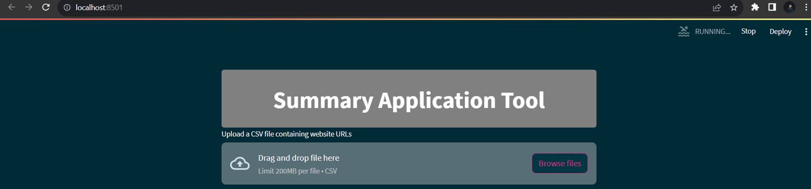
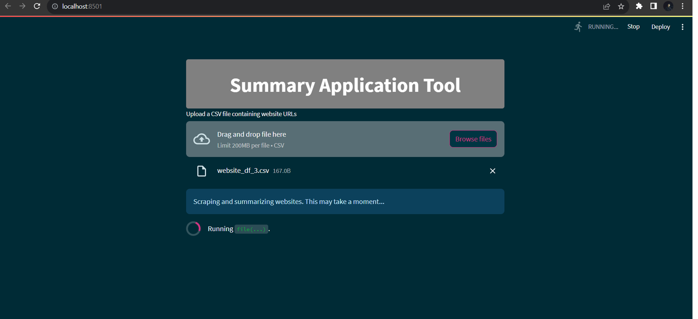
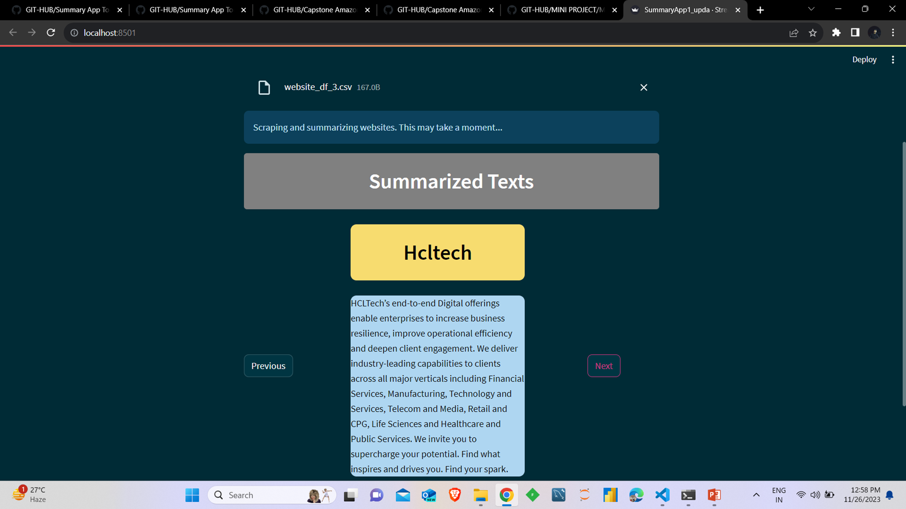
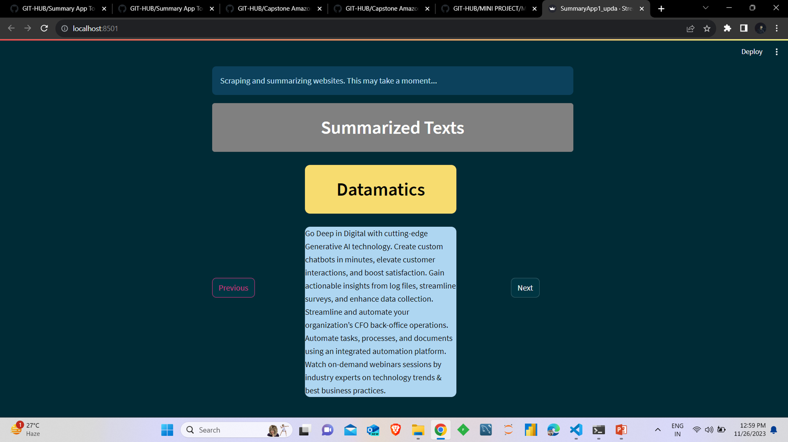

# Web_Summary_App

#### 1) Create environement
#### 2) Replicate all the files
#### 3) Pip install requirements.txt file
```
pip install -r requirements.txt
```
#### 4) Run the SummaryApp.py as-->streamlit run SummaryApp.py
```
streamlit run SummaryApp.py
```
#### 5) Streamlit app will open
#### 6) Insert your Csv file containing website's url
```
* Column like--> ['Website_name']
*                https://www.tcs.com
```




=======

